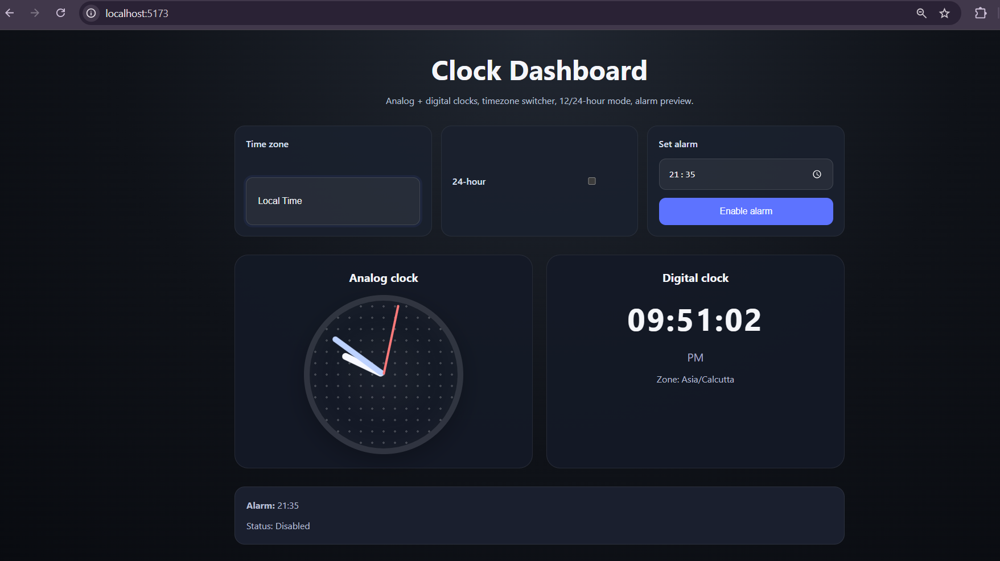
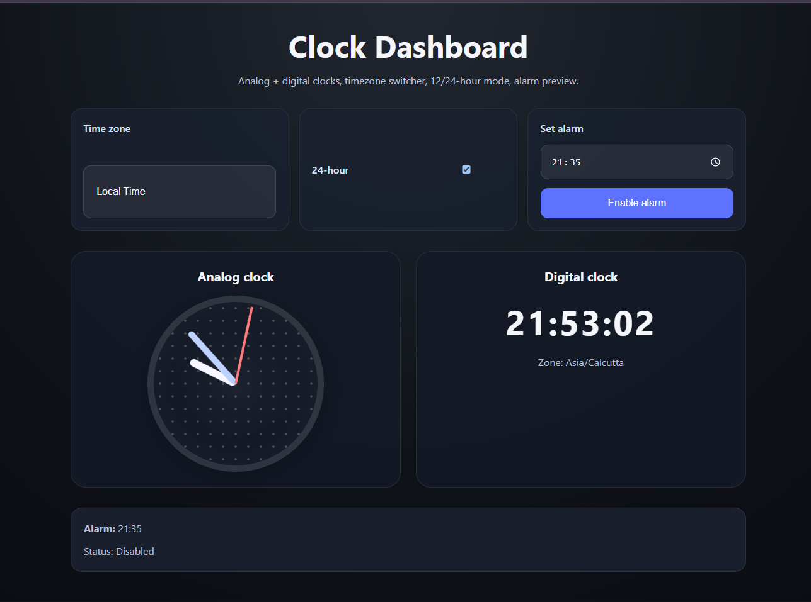
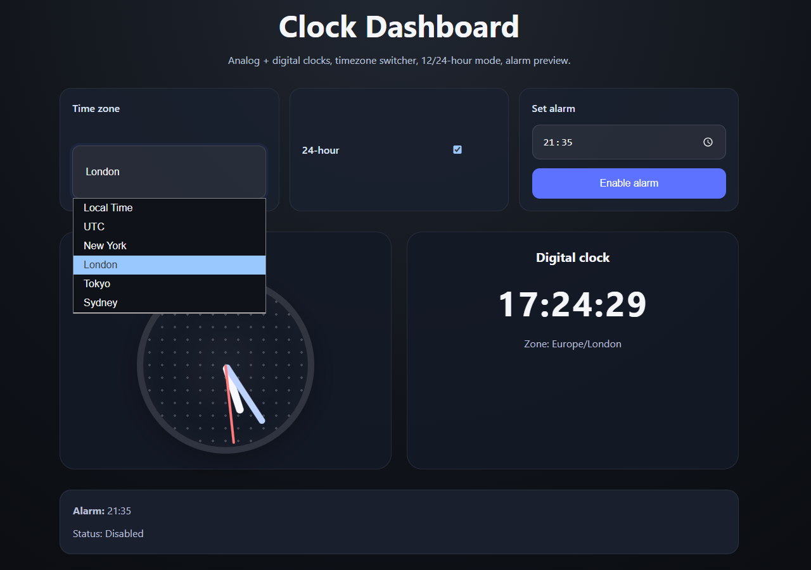

# ⏰ Clock Dashboard

A modern and responsive **Clock Dashboard** built using **React** and **Vite**. The application provides both analog and digital clocks, supports multiple time zones, offers 12/24-hour display modes, and includes a simple alarm preview interface.

---

## ✨ Features

- 🕒 Real-time Analog Clock
- 💻 Real-time Digital Clock
- 🌍 Time Zone Selection
- 🔄 12-Hour / 24-Hour Format Toggle
- ⏰ Alarm Time Selection
- 🔔 Alarm Enable/Disable Interface
- 📱 Responsive User Interface
- 🎨 Modern Dark Theme

---

## 🛠️ Tech Stack

- React.js
- Vite
- JavaScript (ES6+)
- CSS3
- HTML5

---

## 📁 Project Structure

```
Clock-Dashboard/
│
├── src/
│   ├── App.jsx
│   ├── main.jsx
│   ├── styles.css
│
├── index.html
├── package.json
├── vite.config.js
└── README.md
```

---

## 🚀 Getting Started

### Prerequisites

Make sure you have installed:

- Node.js (v18 or above)
- npm

### Installation

Clone the repository

```bash
https://github.com/dhanshree58/clock-react-app.git
```

Install dependencies

```bash
npm install
```

Start the development server

```bash
npm run dev
```

Open your browser and visit

```
http://localhost:5173
```

---

## 🎯 Functionalities

### Analog Clock

- Displays the current time using moving hour, minute, and second hands.
- Updates automatically every second.

### Digital Clock

- Shows the current time in digital format.
- Supports both 12-hour and 24-hour display modes.

### Time Zone Support

- Allows users to switch between different time zones.
- Automatically updates both analog and digital clocks.

### Alarm

- Users can select an alarm time.
- Alarm can be enabled or disabled.
- Displays the currently selected alarm status.

---

## 📷 Screenshots

### Main Dashboard







---

## 🔮 Future Enhancements

- Multiple alarms
- Alarm notification with sound
- Stopwatch
- Countdown timer
- World clock support
- Theme switch (Light/Dark)
- Save preferences using Local Storage
- Responsive mobile optimization


